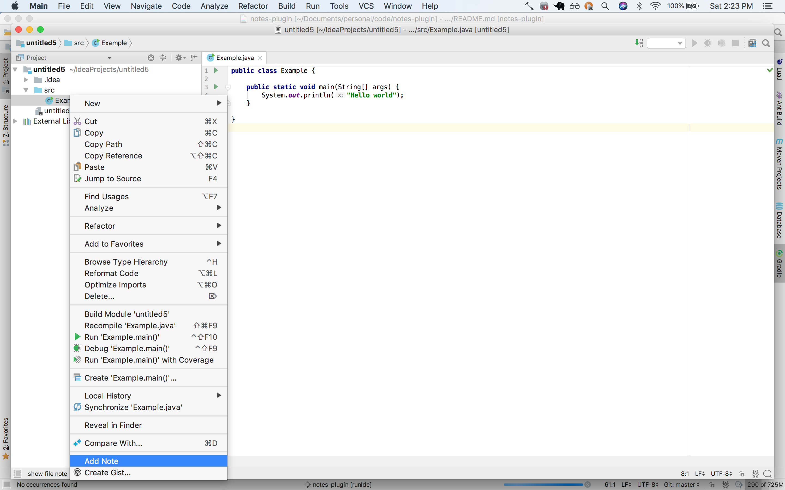
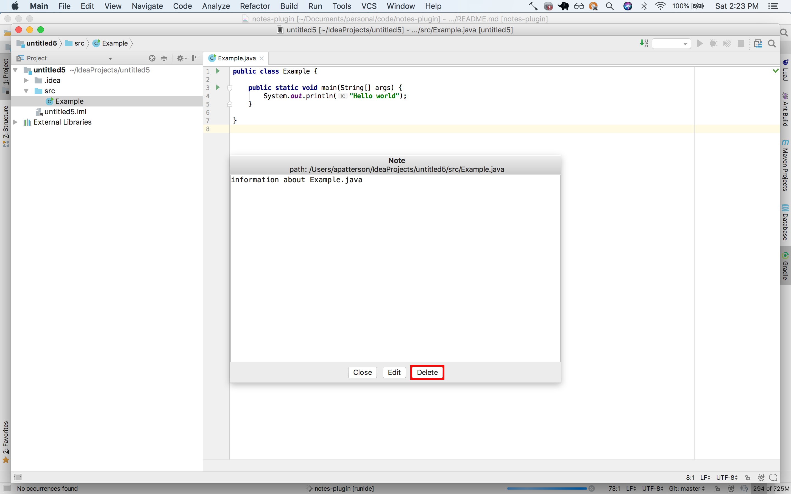
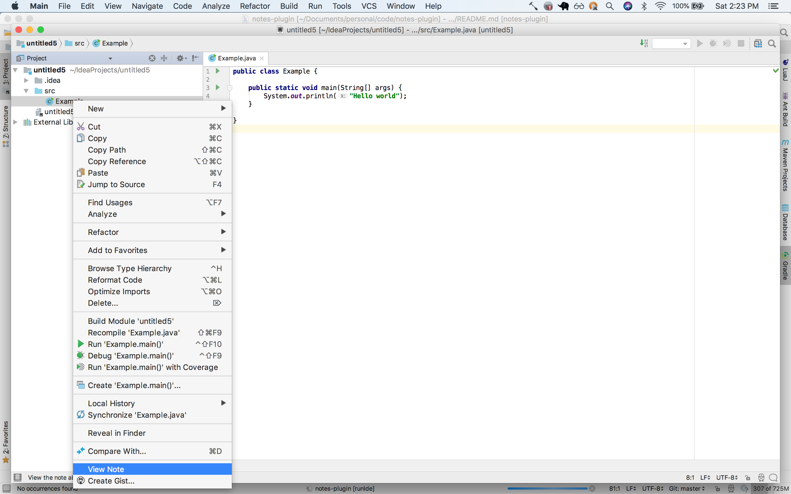
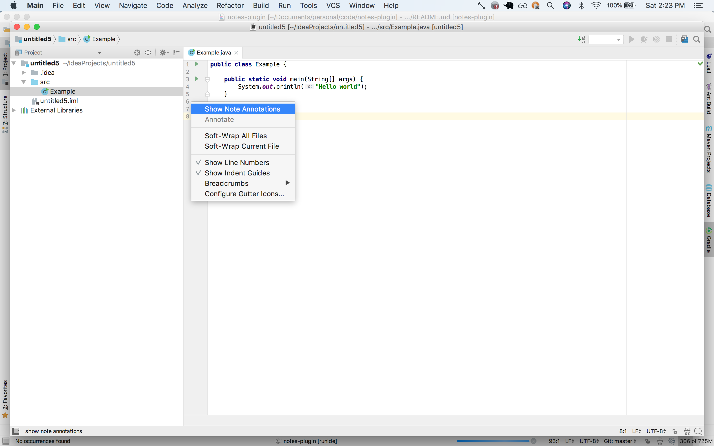
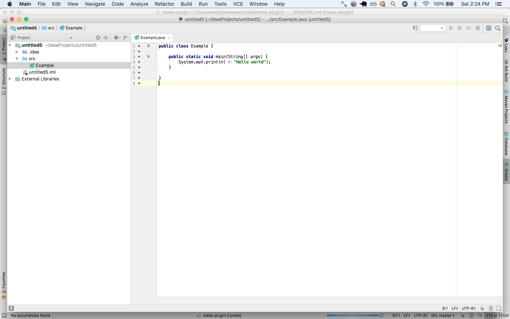
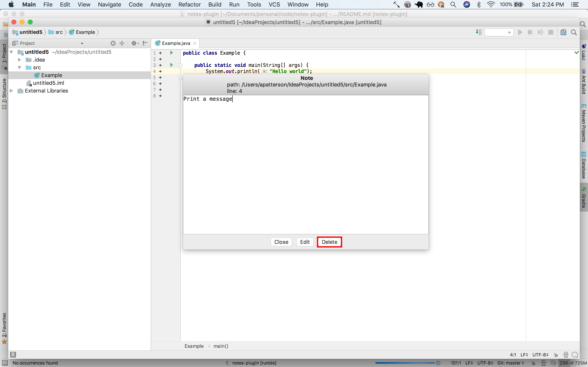
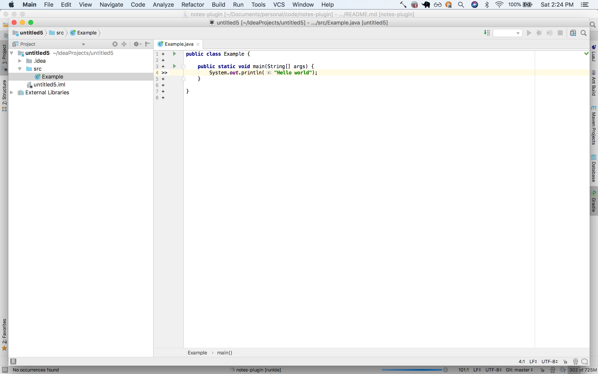
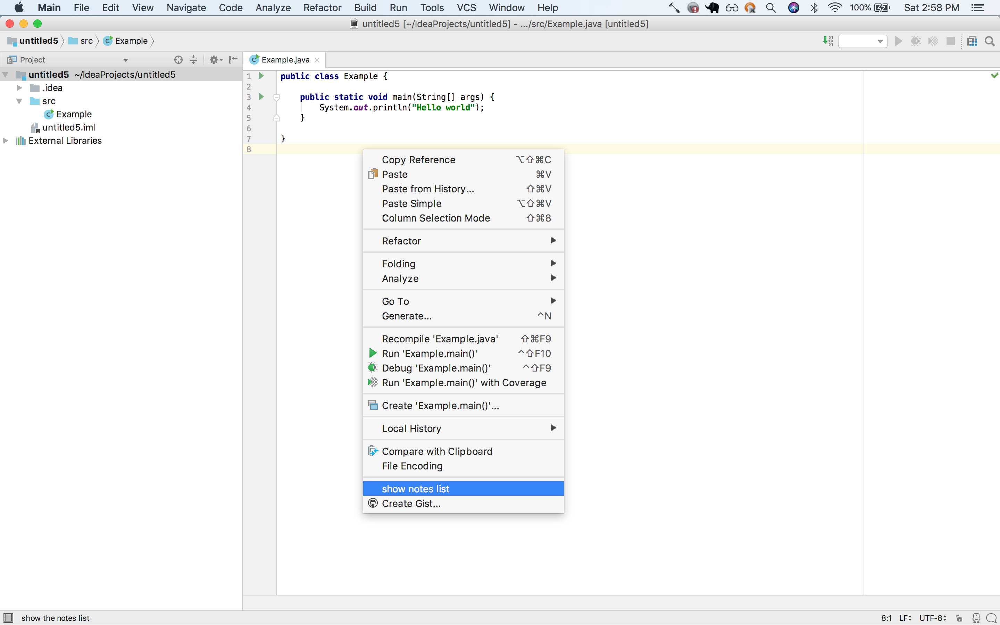
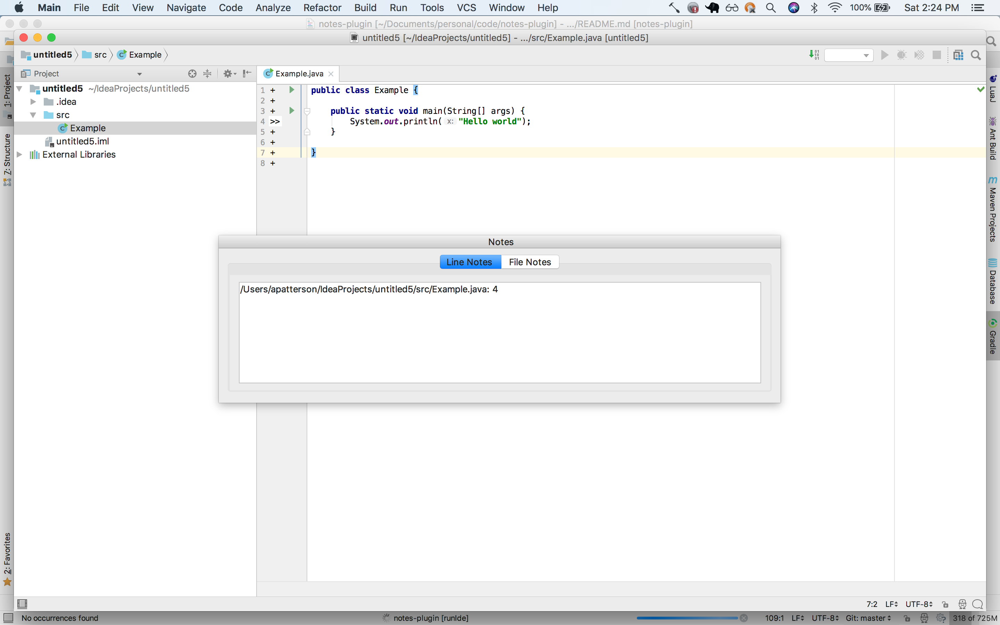

# notes-plugin
An Intellij plugin for recording and managing notes about files and lines in files, without altering the contents of the files. Context menu options and gutter annotations are provided to add and view notes, and popups are provided for editing, saving and deleting as well as viewing a list of all notes in a project.

## Prerequisites
Install Intellij Idea: [download](https://www.jetbrains.com/idea/download/#section=mac) 

## Installation 
Install via one of the following:
* Directly from the plugin repository for the [documented workflow](https://www.jetbrains.com/help/idea/installing-updating-and-uninstalling-repository-plugins.html)
* From disk
    1. Obtain a copy of the plugin .jar file via one of the following
       * Download from the [Intellij Plugin Repository](https://plugins.jetbrains.com/plugin/10895-notes-plugin)
       * Clone this repository and build the .jar via Gradle. The .jar file will be located in build/libs/notes-plugin-x.y.z-SNAPSHOT.jar
    2. Choose "Install from Disk" from the plugins section of the preferences window
    
## Usage
* Record a note about a file via context menu:

* Edit a note about a file:

* View a note about a file via context menu:

* Show annotations for notes about lines in a file via context menu:

* Annotations for notes about lines in a file:

    * Annotations will appear as ">>" if there is note about the line or "+" if there is no note. 
    * Click the annotation to add/edit a note about a line.
    * A preview of the note will be shown in the tooltip when hovering over an annotation
* Edit a note about a line in the file:

* Annotations automatically updated:

* View a list of all notes via context menu:

* Select a note from the list:

    * Click a note in the list to navigate to the corresponding file and open the note
    * Hover over a note in the list to preview the note via the tooltip

    
## Running Tests
TODO: write tests

## License
This project is licensed under the MIT License - see the [LICENSE](https://github.com/albertpatterson/notes-plugin/blob/master/LICENSE) file for details
